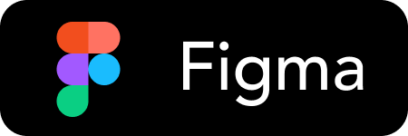
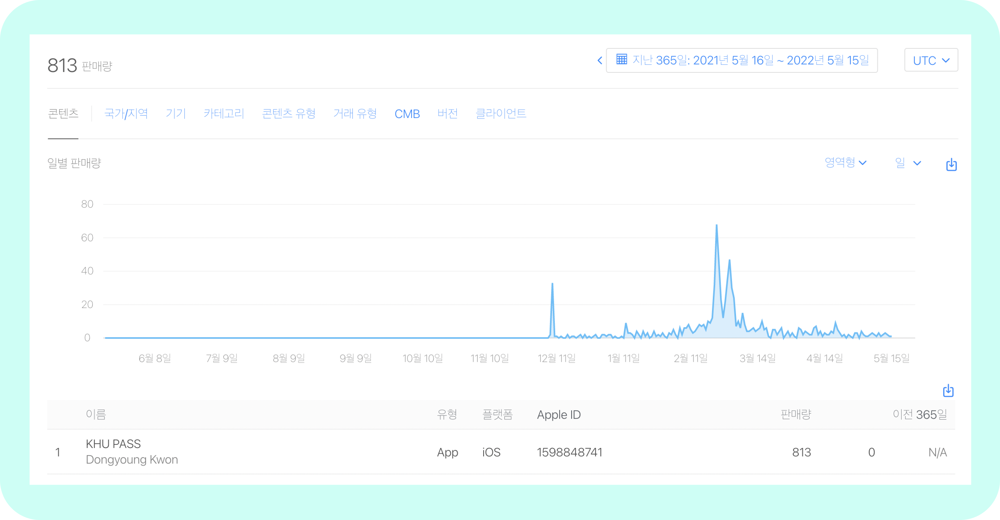

<h2>KHU PASS - 경희대학생을 위한 쉽고 편리한 도서관 출입</h2>

PassKit을 활용하여 경희대 도서관 출입증을 애플 월렛에 보관합니다. 이를 통해 학생증을 직접 찍는 것보다 빠르게 도서관 출입이 가능토록 합니다.

 

  <a href="CONTRIBUTING.md">Contributing Guidelines</a>
  ·
  <a href="https://github.com/Chuncheonian/khupass/issues">Submit an Issue</a>
  ·
  <a href="https://github.com/Chuncheonian/khupass/discussions">Discussion</a>
   
   

  <!-- shields -->
  <!-- version -->
  
  <!-- license -->
  
  <!-- platform -->
  
  <!-- swift version -->
  
  <!-- xcode version -->
  

   
   

  https://user-images.githubusercontent.com/29334434/147747353-e8fdd332-5b17-4e3b-920e-a420aa811b95.MP4

## About

* KHU PASS는 기존 경희대학교 도서관 출입방법의 불편함을 해결하고자 제작하였습니다.
* [PassKit](https://developer.apple.com/documentation/passkit/wallet) 프레임워크를 사용하여 [Apple 지갑](https://www.apple.com/kr/wallet/)에 도서관 출입증을 보관을 통해 출입방식을 개선하였습니다. 
* 경희대학교 국제캠퍼스, 서울캠퍼스 중앙 도서관에 근처에 있으면 자동적으로 Pass가 아이폰 잠금화면에 띄워집니다.

 

## Architecture

  

### iOS

* UIKit 프레임워크를 사용하였으며, MVC 구조입니다.
* Swift Modern Concurrency를 사용하였습니다.

### Server

* Pass를 생성할 수 있도록 Server / Serverless 를 구현하였으며, 비용절감을 위해 Serverless 프레임워크를 활용하여 배포 중입니다.

### S3

* Lambda에서 생성된 Pass를 잠시 보관 후, iPhone으로 보내기 위해 AWS S3를 사용하였습니다.

 

## iOS

### UX / UI를 신경썼습니다.

KHU PASS는 User로부터 데이터를 받아 Pass를 생성하는 App입니다.
요구사항을 User가 명확하게 인식하면서, Human Error가 발생하지 않도록 UX를 설계하였습니다.

### MVC 구조입니다.

KHU PASS는 간단한 기능만이 존재하면서, User로부터 받는 Action은 화면 전환만 있어 
MVVM이 아닌 MVC 구조로 설계하였습니다.

또한, ViewController에서 View를 분리하였습니다.
이로 인해, View는 화면을 그리는 역할에만 집중하고, Life Cycle 관리는 ViewController에서 
진행되도록 했습니다.

### UI는 Code base로 제작했습니다.

UI는 Storyboard가 아닌 코드를 통해 뷰를 작성했습니다.
뿐만 아니라, AutoLayout을 쉽게 작성하고 코드를 줄이기 위해 SnapKit, Then 라이브러리를 활용하였습니다.

또한, 공통적으로 사용하는 UI Component를 Custom Class화 하여 재사용성을 높였습니다.

### PassKit을 사용했습니다.

이 프로젝트를 설계할 때, 가장 신경을 쓴 부분은 PassKit 프레임워크입니다.
개인적으로 PassKit이 사용된 시중의 서비스를 많이 써왔으며, 직접 만들고 싶은 Needs가 있었습니다.

하지만, 개발 초기에는 PassKit을 다룬 해외 아티클조차 없어 많은 우여곡절을 겪었습니다.

이번 개발을 통해, 공식문서을 읽는 것에 익숙해졌으며, 특히 인증서에 대해 많은 것을 깨달았습니다.

 

## Result

  

    <strong>2022.05 기준 800+ 다운로드</strong>

 

## Contributing

### Contributing Guidelines

KHU PASS에 기여하기 위해 먼저, [Contributing Guidelines](./CONTRIBUTING.md)을 읽어주세요.

### TestFlight

KHU PASS의 베타 테스팅을 원하면 [TestFlight](https://testflight.apple.com/join/KmDZoCVe)를 사용해주세요.

 

## Author

권동영 Dongyoung Kwon [@Chuncheonian](https://github.com/Chuncheonian), [chuncheonian@gmail.com](mailto:chuncheonian@gmail.com)

 

## License

KHU PASS is available under the [MIT license](./LICENSE).