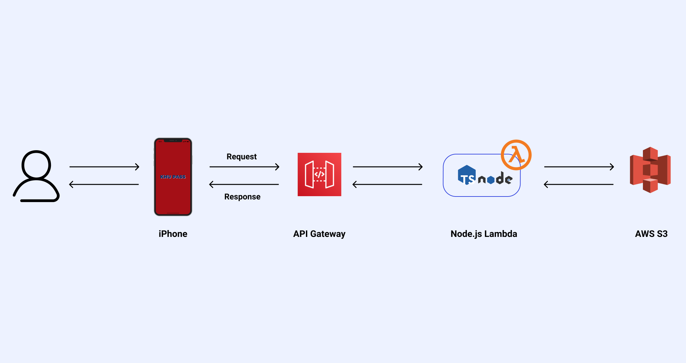

<h2>KHU PASS - 경희대학생을 위한 쉽고 편리한 도서관 출입 </h2>

PassKit을 활용하여 경희대 도서관 출입증을 애플 월렛에 보관합니다. 이를 통해 학생증을 직접 찍는 것보다 빠르게 도서관 출입이 가능토록 합니다.

  

<!-- shields -->
<!-- version -->

<!-- platform -->

<!-- swift version -->

<!-- xcode version -->

<!-- figma -->

 
 

https://user-images.githubusercontent.com/29334434/147747353-e8fdd332-5b17-4e3b-920e-a420aa811b95.MP4

## About

* KHU PASS는 기존 경희대학교 도서관 출입방법의 불편함을 해결하고자 제작하였습니다.
* [PassKit](https://developer.apple.com/documentation/passkit/wallet) 프레임워크를 사용하여 [Apple 지갑](https://www.apple.com/kr/wallet/)에 도서관 출입증을 보관을 통해 출입방식을 개선하였습니다. 
* 경희대학교 국제캠퍼스, 서울캠퍼스 중앙 도서관에 근처에 있으면 자동적으로 Pass가 아이폰 잠금화면에 띄워집니다.

## Architecture

  

### iOS

* UIKit 프레임워크를 사용하였으며, SnapKit을 활용하여 Autolayout을 하였습니다.

### Server

* Pass를 생성할 수 있도록 Server / Serverless 를 구현하였으며, 비용절감을 위해 Serverless 프레임워크를 활용하여 배포 중입니다.

### S3

* Lambda에서 생성된 Pass를 잠시 보관 후, iPhone으로 보내기 위해 AWS S3를 사용하였습니다.

## Next Step

1. Dark Mode 적용
2. 경희대 건물 출입을 위해 실시간 변경되는 QR 기능 개발 (v2.0)

## Contributing

KHU PASS의 베타 테스팅을 원하면 [TestFlight](https://testflight.apple.com/join/KmDZoCVe)을 사용해주세요.

## Author

권동영 Dongyoung Kwon [@Chuncheonian](https://github.com/Chuncheonian) , [chuncheon@duck.com](mailto:chuncheon@duck.com)